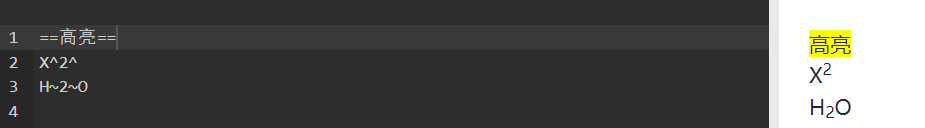

# 写在前面
为了更好的记录学习过程中的点点滴滴，故搜集了一些资料进行学习，这里就算是我学习整理的一些内容，正所谓“好记性不如烂笔头”，所以即时的记录才是学习的基石。

`话不多说，我们开始吧` ✊️

`别着急，慢慢学，才比较快` 💪

`如果你想一口气学完，那也没有问题，甚至是极好的，但`**千万**`别忘了即时的复习和常回来看看` ⛽️

🤪 我有个很喜欢的诗歌，这里也分享给你 👋 `日拱一卒无有尽，功不唐捐终入海` 👋

## 内容

### 标题
文章的开头总是从标题开始，所以突出重点的标题和重要性分明的层次标题样式往往十分重要。

markdown提供了`6个`不同的标题级别，这里的标题级别的不同主要体现在标题字体的大小。

语法简述：

> 先输入`#`(这里输入的`#`的数量代表不同的标题级别，如下面的形式所示),然后**空格**，最后输入你的内容即可。

形式：
```
# 一级标题
## 二级标题
### 三级标题
#### 四级标题
##### 五级标题
###### 六级标题
```

效果：
> # 一级标题
>> ## 二级标题
>>> ### 三级标题
>>>> #### 四级标题
>>>>> ##### 五级标题
>>>>>> ###### 六级标题

#### 其他的方式：

#### 1. 第一种是特殊的情况，因此使用的不多，也不必硬记，做个了解就行，并且这个方法也有很大的局限性，markdown只提供了一级和二级标题的这种表示方法。

语法简述：
> 先输入标题，然后输入`===`分割之后，`===`上面的内容就成为了一级标题
> 
> 先输入标题，然后输入`---`分割之后，`---`上面的内容就成为了二级标题

形式：

```
> 一级标题
> ===
*注意*：这里的`=`的个数最少是1个，最多不做限制

> 二级标题
> ---
```

效果：

一级标题
=

二级标题
-

#### 2. 第二种是与HTML的标题兼容的，也就是HTML的标题语法这里一样适用。

语法简述：
> 输入<h*>标题内容，支持最高6级，也就是\*的取值为1，2，3，4，5，6
>
> 输入</h*>形成一对标识符
> 

形式：
```
<h1>一级标题</h1>
<h2>二级标题</h2>
<h1>三级标题</h3>
<h1>四级标题</h4>
<h1>五级标题</h5>
<h1>六级标题</h6>
```
效果：
> <h1>一级标题</h1>
> <h2>二级标题</h2>
> <h3>三级标题</h3>
> <h4>四级标题</h4>
> <h5>五级标题</h5>
> <h6>六级标题</h6>

### 文本
文本内容是一篇笔记，文章或者博客的精华，也是作者内容输出的地方，所以markdown也提供了丰富的文本标识方法。
#### 普通文本

语法简述：
> 在空白处直接输入的内容就是普通文本
>
> 通俗一点说就是不插入如何其他字符或者符号的文本内容就是普通文本


形式：
我是一个普通文本，看不出来吧！

效果：
我是一个普通文本，看不出来吧！

#### 代码块或者文本块

语法简述：
> 先输入```,然后输入内容
>
> 最后输入```,形成一对标识符即可

形式1：

```
  这是一个代码块
```

效果1：

```
这是一个代码块
```

形式2：

```
```这是一个代码块```
```

效果；

```
这是一个代码块
```

#### 强调
文章中总会有需要特殊强调的内容，这里的**强调**主要是指从**字体**上操作，类似于你之前使用`office word`，`wps`等工具的设置字体。

|语法|效果|
|----|-----|
|`*斜体1*`|*斜体1*|
|`_斜体2_`| _斜体2_|
|`**粗体1**`|**粗体1**|
|`__粗体2__`|__粗体2__|
|`这是一个 ~~删除线~~`|这是一个 ~~删除线~~|
|`***斜粗体1***`|***斜粗体1***|
|`___斜粗体2___`|___斜粗体2___|
|`***~~斜粗体删除线1~~***`|***~~斜粗体删除线1~~***|
|`~~***斜粗体删除线2***~~`|~~***斜粗体删除线2***~~|
|`<del>删除</del>`|<del>删除</del>|
|`<b>粗体</b>`|<b>粗体</b>|
|`<i>斜体</i>`|<i>斜体</i>|
|`<small>小字号</small>`|<small>小字号</small>|
|`我是一个下标<sub>下标</sub>`|我是一个下标<sub>下标</sub>|
|`我是一个下标<sup>上标</sup>`|我是一个上标<sup>上标</sup>|
|`<ins>插入字</ins>`|<ins>插入字</ins>|
|`<u>下划线</u>`|<u>下划线</u>|
|`H~2~O`|H~2~O|
|`X^2^`|X^2^|
|`==高亮==`|==高亮==|

**注意** 下面三个用法好像`github`用不了，但是语法还是存在的，在其他的软件还是可以使用的,如`网易云笔记`就支持。
！[wy云笔记](pic/figure/截图.png)

<div align="center">
    
</div>


**贴士** 这些命令不必死记硬背，忘了就回来看看，温习一下，慢慢的，你也就记住了。

#### Markdown中直接显示图片

形式：

```
<div align="center">

</div>
```

#### 无序列表

语法简述：
> 先输入`*`,`+`,`-`
>
> 然后输入**空格**，注意这里的空格一定要输入，否则会出现错误


形式1：

```
* 表项1

* 表项2

* 表项3
```

效果1:

* 表项1

* 表项2

* 表项3


形式2：

```
<ul>
<li><p>表项1</p></li>
<li><p>表项2</p></li>
<li><p>表项3</p></li>
</ul>
```

效果2:

<ul>
<li><p>表项1</p></li>
<li><p>表项2</p></li>
<li><p>表项3</p></li>
</ul>

#### 多级无序列表

形式:

```
* 一级无序列表会转义成实心圆点
  * 二级无序列表会被转义成空心圆点
    * 三级无序列表会被转义成实心正方形
      * 四级无序列表效果就不会再变化，依旧是实心正方形
```

效果：

* 一级无序列表会转义成实心圆点
  * 二级无序列表会被转义成空心圆点
    * 三级无序列表会被转义成实心正方形
      * 四级无序列表效果就不会再变化，依旧是实心正方形
     
        
#### 有序列表

语法简述：
> 先输入数字1，2，3....
>
> 输入**空格**
>
> 输入内容即可

形式1；

```
1. 有序列表1
2. 有序列表2
3. 有序列表3
```

效果1：

1. 有序列表1
2. 有序列表2
3. 有序列表3

形式2：

```
<ol>
<li>java</li>
<li>python</li>
</ol>
```

效果2：

<ol>
<li>java</li>
<li>python</li>
</ol>


#### 多级有序列表

形式：

```
1. 这是一级有序列表，第一层级还是数字1
  1. 这是二级有序列表，数字在这里会转义成罗马数字
    1. 这是三级有序列表，数字在这里会被转义成英文字母
      1. 这是四级有序列表，显示效果就不会再变化了，依旧是英文字母
```

效果：

1. 这是一级有序列表，第一层级还是数字1
  1. 这是二级有序列表，数字在这里会转义成罗马数字
    1. 这是三级有序列表，数字在这里会被转义成英文字母
      1. 这是四级有序列表，显示效果就不会再变化了，依旧是英文字母
    
#### HTML的自定义列表

形式：

```
<dl>
<dt>java</dt>
<dd>- juc jdbc</dd>
<dt>python</dt>
<dd>- pandas numpy</dd>
</dl>
```

效果:

<dl>
<dt>java</dt>
<dd>- juc jdbc</dd>
<dt>python</dt>
<dd>- pandas numpy</dd>
</dl>

#### 分割线

语法简述：
> markdown中的分割线只需要输入`***`,`---`,`___`即可实现

形式：
```
***
* * *
---
- - -
___
_ _ _
```

效果：

***
* * *
---
- - -
___
_ _ _

#### 注释

形式：
```
> Markdown: Syntax[^1]
>
> [^1]: https://svc.011.idv.tw/CodeHelper/GitHub/MarkDown/Markdown%20Syntax.pdf
```

效果：

> Markdown: Syntax[^1]
>
> [^1]: https://svc.011.idv.tw/CodeHelper/GitHub/MarkDown/Markdown%20Syntax.pdf
[^1]: https://svc.011.idv.tw/CodeHelper/GitHub/MarkDown/Markdown%20Syntax.pdf

#### 数学公式

这里的数学公式的语法符合`latex`的数学公式的语法

`特殊字符`

> $$alpha$$
>
> $$beta$$
>
> $$gamma$$
>
> $$eta$$
>
> $$theta$$
>

`数学计算`

> $$\sqrt{x}\quad$$
>
> $$\ x_{ij }^2\quad$$
>
> $$ \frac{1}{2}$$
>
> $$\dfrac {1}{2}$$
>
> $$ \pm\; \times\; \div\; \cdot\; \cap\; \cup\;
\geq\; \leq\; \neq\; \approx\; \equiv \$$
>
> $$\sum\nolimits_{i=1}^n i\quad
8 \prod\nolimits_{i=1}^n\quad
\lim\nolimits_{x\to0}x^2\quad
10 \int\nolimits_a^b x^2 dx \$$
>
> $$\sum_{i=1}^n i\quad \prod_{i=1}^n\quad
2 \lim_{x\to0}x^2\quad \int_a^b x^2 dx$$
>
> $$\bar{x} \vec{x} \hat{x} \tilde{x}$$
>
> $$ x_1,x_2,\dots ,x_n\quad 1,2,\cdots ,n\quad
\vdots\quad \ddots \$$
>

#### 复选框

语法简述：
> 先输入`-`，然后**空格**
>
> 再输入[状态]，内容就是你要输入状态以表示`完成`和`未完成`状态
>
> 接着输入**空格**,
>
> 最后输入你的内容即可

**今日学习目标**

> 完成了就在前面打上x，代表已经完成
>
> 没有完成的保持状态不同
>
> 但是一定要每天学习一点点，日积月累的力量是你无法想象的.


形式：

```
- [x] java
- [x] python
- [x] golang
- [ ] c
- [ ] c++
- [ ] linux
```

效果：

- [x] java
- [x] python
- [x] golang
- [ ] c
- [ ] c++
- [ ] linux

**闲聊** 一天能学这么多内容也非一件容易的事。

#### 链接

markdown中的链接主要分为**行内式**和**参考式**

> 行内式就是内容和链接在一起紧凑的表示
>
> 参考式就是大家平时写论文的**参考文献**的使用方式，在引用处打上表示以表示引用文献

形式：

```
|#|语法|效果|
|---|----|-----|
|1|`[我的github](https://github.com/iukkeopaa/ "悬停显示")`|[我的github](https://github.com/iukkeopaa/ "悬停显示")|
```
**注意** *悬停显示*：你将鼠标放在链接上，然后没有直接点击时的消息显示

效果：

|#|语法|效果|
|---|----|-----|
|1|`[我的github](https://github.com/iukkeopaa/"我的github")`|[我的github](http://blog.csdn.net/guodongxiaren "我的github")|


#### 本地资料的链接
本地的资料链接只要采用`路径`的方式即可

> 绝对路径：从根目录往下寻找，直到找到目标文件为止的路线叫做绝对路径
>
> 相对路径：从目标文件所在处向上寻找一层或者两个，亦或者是多层，但是不包括根目录的路径叫做相对路径

形式：

```
|语法|效果|
|----|-----|
|`[心灵鸡汤](心灵鸡汤)`|[诗歌](心灵鸡汤)|

```
**学累了吧**

> 那就来饮下这碗心灵鸡汤，伸个懒腰，来杯热水(冰镇的cola最适宜)，实在找不到其他事放松，那就闭目养神一下。
>
> 休息好了，在继续，其实一点也不慢，因为，慢慢来才比较快


效果：

|语法|效果|
|----|-----|
|`[心灵鸡汤](心灵鸡汤)`|[心灵鸡汤](心灵鸡汤)|

**闲聊** 鸡汤虽好可不能贪杯，记住`短暂的休息是为了更好的前行`

#### 锚点

语法简述：
> 每一个打上了`#+内容`的地方都可以用锚点的方式进行跳转

形式：
```
|语法|效果|
|---|---|
|`[回到顶部](#写在前面)`|[回到顶部](#写在前面)|
```
这里的`#写在前面`就对应着开头的内容

效果：

|语法|效果|
|---|---|
|`[回到顶部](#写在前面)`|[回到顶部](#写在前面)|
|`[回到底部](#写在前面)`|[回到底部](#写在后面)|


#### 图片链接

语法简述：
> 
>
> 图片的链接比起直接的链接的不同之处就在`[]`前加上一个`!`就行

形式：

```
|---|----|:---:|
|1|`[![github-avatar]](pic/figure/oha.jpeg)`|[![github-avatar]](pic/figure/oha.jpeg)|

```

效果：

|---|----|:---:|
|1|`[![github-avatar]](pic/figure/oha.jpeg)`|[![github-avatar]](pic/figure/oha.jpeg)|

#### 表格

markdown中的表格的制作形式也是很简单，并且多样性。

形式1：

```
表头1  | 表头2|
--------- | --------|
表格单元  | 表格单元 |
表格单元  | 表格单元 |
```

效果1：

表头1  | 表头2|
--------- | --------|
表格单元  | 表格单元 |
表格单元  | 表格单元 |

形式2：

```
| 表头1     | 表头2    | 表头3    |
| :------------- | :-------------: | -------------: |
| java    | juc      | jdbc |
| go      | router     | channel    |
| linux      | cd      | pwd      |
```
**注意** `| :------------- | :-------------: | -------------: |`中的`：`表示对其的方式，在那边就表示向那边对齐
效果2：

| 表头1     | 表头2    | 表头3    |
| :------------- | :-------------: | -------------: |
| java    | juc      | jdbc |
| go      | router     | channel    |
| linux      | cd      | pwd      |

形式3：

```
| 表头1     | 表头2    | 表头3    |
| :------------- | :-------------: | -------------: |
| *java* | juc  | jdbc |
| **go**  | ~~router~~ | <del>channel</del> |
| ***linux***  | cd | ***~~pwd~~***  |
```

效果3：

| 表头1     | 表头2    | 表头3    |
| :------------- | :-------------: | -------------: |
| *java* | juc  | jdbc |
| **go**  | ~~router~~ | <del>channel</del> |
| ***linux***  | cd | ***~~pwd~~***  |

形式4：

```
<table border="1">
    <tr>
        <td>row 1, cell 1</td>
        <td>row 1, cell 2</td>
    </tr>
    <tr>
        <td>row 2, cell 1</td>
        <td>row 2, cell 2</td>
    </tr>
</table>
```

效果4：

<table border="1">
    <tr>
        <td>row 1, cell 1</td>
        <td>row 1, cell 2</td>
    </tr>
    <tr>
        <td>row 2, cell 1</td>
        <td>row 2, cell 2</td>
    </tr>
</table>


形式5：

```
<table border="1">
    <tr>
        <th>Header 1</th>
        <th>Header 2</th>
    </tr>
    <tr>
        <td>row 1, cell 1</td>
        <td>row 1, cell 2</td>
    </tr>
    <tr>
        <td>row 2, cell 1</td>
        <td>row 2, cell 2</td>
    </tr>
</table>
```

效果5:

<table border="1">
    <tr>
        <th>Header 1</th>
        <th>Header 2</th>
    </tr>
    <tr>
        <td>row 1, cell 1</td>
        <td>row 1, cell 2</td>
    </tr>
    <tr>
        <td>row 2, cell 1</td>
        <td>row 2, cell 2</td>
    </tr>
</table>

#### 代码高亮

语法简述：
> 先输入```然后加上语言标识，可以是`java``c``python``c++`等主流语言
> 
> 最终的表现形式为
>
> \```c
>
> +你的内容+
>
> \```

效果：

```Java
public static void main(String[]args){} //Java
```
```c
int main(int argc, char *argv[]) //C
```
```cpp
string &operator+(const string& A,const string& B) //cpp
```

#### 反斜杠

> 相当于反转义作用。使符号成为普通符号

#### 代码和文本强调

语法简述:

> 用\`将内容包围即可


形式1:

```
`java` `go` `c` `linux`
```

效果1:

`java` `go` `c` `linux`

形式2:

```
`java`

`go`

`c`

 `linux`
```

效果：

`java`

`go`

`c`

 `linux`

 #### 引用
 引用类似我们经常遇到的`文件目录`，在`文件目录`中一层一层的打开直到找到我们所需要的内容。

 形式1：
 
```
> 嵌套1
>> 嵌套2
>>> 嵌套3
>>>> 嵌套4
>>>>> 嵌套5
```

效果1：

> 嵌套1
>> 嵌套2
>>> 嵌套3
>>>> 嵌套4
>>>>> 嵌套5


形式2:

```
> 嵌套1
> 嵌套2
> 嵌套3
> 嵌套4
> 嵌套5
```

效果2:

> 嵌套1
> 嵌套2
> 嵌套3
> 嵌套4
> 嵌套5

形式3:

```
> 嵌套1
>
> 嵌套2
>
> 嵌套3
>
> 嵌套4
>
> 嵌套5
```

效果2:

> 嵌套1
> 
> 嵌套2
> 
> 嵌套3
> 
> 嵌套4
> 
> 嵌套5


#### 折叠

折叠有着特殊的表达形式，如下面所示

形式1:

```
<details>
<summary>WEB开发</summary>

##### 服务器
xxxx

##### 中间件
xxxx

##### 数据库
xxxx

</details>
```

效果；

<details>
<summary>WEB开发</summary>

##### 服务器
xxxx

##### 中间件
xxxx

##### 数据库
xxxx

</details>


#### diff语法
语法简述：
```
> 输入` ```diff `之后，再输入内容即可
> `+` 表示增加
> `-` 表示删除
```

效果1；

```diff
+ 日拱一卒无有尽，
- 功不唐捐终入海。
! 功不唐捐，
# 玉汝于成。
```

效果2；

```diff
function addTwoNumbers (num1, num2) {
-  return 1 + 2
+  return num1 + num2
}
```

效果3：

```diff
fun main(){
+ say("")  
return ""
}

fun main(){
- say("")  
return ""
}
```
  
#### 表情

形式:
```
:smile:
```

效果：

😄

拓展1：emoji表情的适当合理的使用能很好的增加可阅读性和阅读的趣味性，所以emoji表情的使用也越来越普遍，这里我简单列举几个emoji表情的网站以供参考

> https://emojixd.com/
> 
> https://www.emojiall.com/zh-hans
> 
> https://openmoji.org/
>
> https://www.webfx.com/tools/emoji-cheat-sheet/

拓展2：除了使用emoji表情之外，还有很多趣味的表情包的恰当使用同样能增加可读性和趣味性，所以这里我也简单列举几个表情包的网站

> https://www.dbbqb.com/
>
> https://www.fabiaoqing.com/
>
> https://www.doutupk.com/
>
> https://www.doutub.com/
>
> https://emojipedia.org/

#### 写在后面

🥳太棒了，这一路上学到的东西实在太有趣了，没想到一个简单的文档笔记工具居然能蕴含着这么多的乐趣

💖总说`站在巨人的肩膀上才能看的更好`，所以这里我也给出了当初学习的时候参考的一些优秀的作品
> https://github.com/younghz/Markdown/blob/master/README.md
>
> https://github.com/guodongxiaren/README/blob/master/README.md
>
> https://github.com/kaivin/markdown/blob/master/readme.md
>
💖正是在这些优秀的作者的基础之上才打开了通往新世界的大门.

bye 👋🏼


